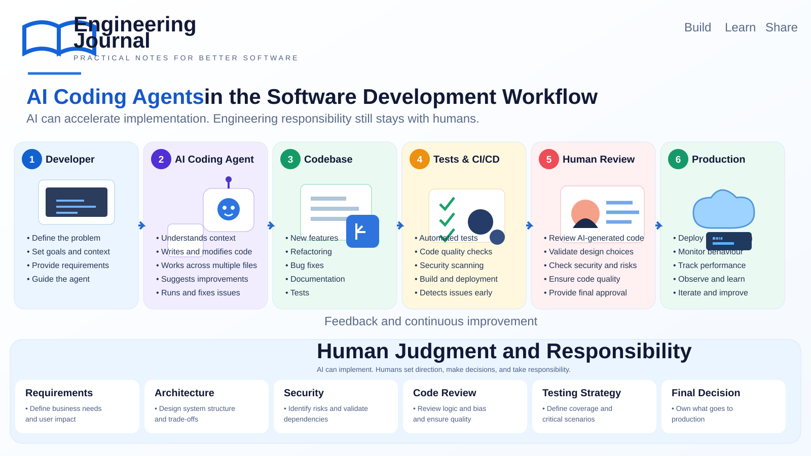

# AI Coding Agents: Who Is Responsible for the Code?

**Estimated Reading Time:** 12 Minutes



## Overview

AI-assisted development has moved beyond code completion.

Modern coding agents can understand a task, inspect an existing codebase, modify multiple files, run commands, execute tests, investigate failures, and continue working through several steps.

That changes the development workflow.

The question is no longer only:

> **Can AI write the code?**

A more useful engineering question is:

> **Who is responsible for the code when an AI coding agent writes or changes it?**

The answer is still the engineering team.

AI can accelerate implementation, but requirements, architecture, security, testing strategy, review, and the final decision to ship still require human judgment.

This article looks at how AI coding agents fit into a practical software development workflow and the engineering controls that become more important as their capabilities increase.

---

# From Code Completion to Coding Agents

Traditional AI coding assistance often looks like this:

```text
Developer
   ↓
Writes code
   ↓
AI suggests code
   ↓
Developer accepts or changes it
```

The developer remains directly involved in almost every code change.

A coding agent can operate at a larger scope:

```text
Developer
    ↓
Task + Context
    ↓
AI Coding Agent
    ↓
Inspect codebase
    ↓
Modify multiple files
    ↓
Run tests / commands
    ↓
Investigate failures
    ↓
Refine implementation
```

The difference is important.

The unit of work changes from **"suggest some code"** to **"complete this engineering task."**

That creates both an opportunity and a responsibility.

---

# What an AI Coding Agent Can Actually Do

Depending on the tool and permissions provided, an AI coding agent may be able to:

- Understand a task from natural-language instructions
- Inspect an existing codebase
- Search for related implementations
- Modify multiple files
- Create new components
- Refactor existing code
- Write tests
- Run builds and test suites
- Investigate compiler or test failures
- Update documentation
- Suggest implementation alternatives
- Review changes against requirements

This can reduce the amount of repetitive implementation work.

But capability is not the same as correctness.

An agent can complete a task successfully from a technical perspective while still making a poor engineering decision.

For example, it may produce code that:

- Works for the provided test cases but misses an important business rule
- Introduces unnecessary complexity
- Changes an API contract unexpectedly
- Creates a security risk
- Performs poorly with production-sized data
- Handles the happy path but not failure scenarios
- Follows an existing pattern that was itself incorrect

This is why the surrounding engineering process matters.

---

# The New Development Workflow

A practical AI-assisted workflow can look like this:

```text
Developer
    ↓
Define the problem
    ↓
Provide requirements and context
    ↓
AI Coding Agent
    ↓
Understand the codebase
    ↓
Implement / modify
    ↓
Run tests and checks
    ↓
Human Review
    ↓
Approve / change / reject
    ↓
CI/CD
    ↓
Production
    ↓
Observe and learn
    ↓
Back to the developer
```

The important point is that AI is **inside the development workflow**, not above it.

The agent is an implementation tool.

The engineering process still provides the boundaries.

---

# Context Is More Important Than Just the Prompt

One of the biggest differences between simple code generation and agentic development is context.

A useful task description may include:

- The problem to solve
- Existing architecture
- Relevant files
- Coding conventions
- Business rules
- Constraints
- Expected behavior
- Tests that should pass
- Things that must not change

A vague request such as:

```text
Add caching to this service.
```

leaves many engineering decisions unspecified.

A better task might explain:

```text
Add caching for the pharmacy lookup.

Requirements:
- Use the existing Redis abstraction.
- Cache only successful lookups.
- TTL should be configurable.
- Do not cache authorization failures.
- Preserve the current API contract.
- Add unit tests for cache hit and cache miss.
- Do not modify unrelated services.
```

The second request gives the agent a much better boundary.

This leads to an important lesson:

> **Better context often produces better engineering output than simply asking the model to write more code.**

---

# AI Can Implement — Humans Still Define the Problem

A coding agent can be very good at implementation.

It does not automatically know what the business actually needs.

Consider a requirement:

> "Allow users to export the report."

There are many unanswered questions:

- Which users?
- Which data?
- What date range?
- Are there authorization restrictions?
- How large can the export become?
- Should the export be synchronous?
- Should it run in the background?
- What happens if the export fails?
- Should the file contain sensitive information?
- How long should the generated file remain available?

These are engineering and product decisions.

The agent can help implement the chosen solution.

It should not silently invent the requirements.

---

# Architecture Still Matters

AI can generate an implementation that looks reasonable locally.

Architecture asks a different question:

> **Does this solution belong in this system?**

For example, an agent may suggest adding another service because it makes the current code easier to isolate.

That may be technically valid.

But introducing another service also creates:

- Deployment overhead
- Monitoring requirements
- Network communication
- Authentication requirements
- Failure modes
- Operational cost
- Additional maintenance

A senior engineer has to consider the system as a whole.

This is one reason architectural decisions should remain explicit rather than being accidental outcomes of code generation.

---

# Code Review Becomes More Important

When humans write every line, a code review usually examines the implementation produced by another engineer.

With AI-assisted development, the same principle still applies.

The reviewer should not assume:

> "The agent wrote it, so it probably knows what it is doing."

Instead, review should focus on:

### Correctness

Does the implementation actually solve the requirement?

### Design

Does it fit the existing architecture?

### Maintainability

Will another engineer understand and maintain it?

### Security

Does it introduce new risks?

### Performance

What happens with realistic production data?

### Error Handling

What happens when dependencies fail?

### Compatibility

Could existing clients or workflows break?

### Tests

Do the tests cover meaningful behavior rather than just increasing coverage numbers?

AI-generated code deserves the same engineering standards as human-generated code.

---

# Tests Are a Safety Net, Not a Replacement for Review

Automated tests become even more valuable when AI is producing code quickly.

A useful pipeline might include:

```text
Code Change
    ↓
Build
    ↓
Unit Tests
    ↓
Integration Tests
    ↓
Static Analysis
    ↓
Security Checks
    ↓
Review
    ↓
Deployment
```

The exact pipeline depends on the system.

The important principle is that the speed of implementation should not bypass the checks that protect the system.

There is also a limitation:

> **A passing test suite does not prove that the implementation is correct.**

Tests can only validate the behavior they actually cover.

If the requirement is wrong, incomplete, or missing from the tests, the pipeline can still produce a green build.

---

# CI/CD Becomes the Guardrail

This is where AI coding agents and CI/CD become closely connected.

If developers can produce changes faster, the delivery pipeline has to remain trustworthy.

Useful automated checks include:

- Build validation
- Unit tests
- Integration tests
- Static analysis
- Dependency scanning
- Security scanning
- Formatting and linting
- API compatibility checks
- Infrastructure validation
- Deployment checks

The goal is not to slow down AI-assisted development.

The goal is to make fast development safe.

A useful way to think about it is:

```text
AI increases implementation speed
                +
CI/CD protects the delivery path
                +
Human review provides engineering judgment
                =
A safer development workflow
```

---

# Security Cannot Be Delegated Blindly

AI-generated code can introduce security problems just like human-written code.

There are additional concerns when an agent can inspect files, execute commands, access tools, or interact with development environments.

Teams should consider:

- What files can the agent access?
- What commands can it execute?
- What credentials are available?
- Can it access production systems?
- Can it modify infrastructure?
- Can it install dependencies?
- Can it access sensitive configuration?
- Are generated changes scanned before deployment?

The principle is simple:

> **Give an agent the minimum access required to complete the task.**

The exact permissions depend on the environment.

But treating an AI coding agent as an unrestricted administrator is difficult to justify in a production engineering workflow.

---

# Human-in-the-Loop vs Human-on-the-Loop

There is an important difference between these two models.

### Human-in-the-loop

The agent proposes or performs an action, and a human reviews it before the next significant step.

```text
Agent → Human → Agent → Human → ...
```

This provides stronger control but can reduce speed.

### Human-on-the-loop

The agent can perform more steps independently while humans monitor the process and intervene when necessary.

```text
Agent → Agent → Agent → Human monitoring
                         ↓
                    Intervention
```

This can improve throughput, but the consequences of a wrong decision can also become larger.

The right balance depends on the risk of the task.

A documentation change and a production database migration should not have the same level of autonomy.

---

# Not Every Task Needs the Same Level of Autonomy

A useful approach is to classify tasks by risk.

| Task | Possible AI Autonomy |
|---|---|
| Documentation update | High |
| Simple refactoring | Medium to High |
| Unit test generation | Medium to High |
| New business feature | Medium |
| Authentication changes | Low |
| Payment workflow changes | Low |
| Database migration | Low |
| Production infrastructure changes | Low |

This is not a universal classification.

The point is that **risk should influence autonomy**.

The more a change can affect users, data, security, money, or production availability, the stronger the review and approval controls should be.

---

# The Risk of "Looks Correct"

One of the most dangerous properties of AI-generated code is that it can look convincing.

A developer may read:

```csharp
if (user.IsAuthorized)
{
    return await service.GetDataAsync();
}
```

and move on.

But the real question may be:

> Authorized to access what data?

The code may compile.

The tests may pass.

The implementation may still violate a data-access rule.

This is why experienced engineering judgment remains important.

The difficult part is often not recognizing whether code is syntactically correct.

It is recognizing whether the code is **correct for the system**.

---

# AI Agents and Existing Codebases

Greenfield projects are relatively easy to discuss.

Existing systems are more interesting.

Real codebases contain:

- Historical decisions
- Legacy patterns
- Workarounds
- Inconsistent naming
- Hidden dependencies
- Integration constraints
- Business rules
- Technical debt
- Tests with different levels of quality

An agent can inspect these patterns and work with them.

But there is a risk:

> **An agent may reproduce an existing problem because the problem looks like an established pattern.**

For example, if several services use a poor error-handling approach, an agent may naturally copy that approach when adding another service.

This is why repository context must be combined with engineering judgment.

The existing codebase is evidence.

It is not automatically the specification.

---

# AI Should Not Become the Architecture

A common mistake is allowing the generated implementation to determine the architecture.

The sequence should generally be:

```text
Problem
   ↓
Requirements
   ↓
Architecture / Design
   ↓
Implementation
   ↓
Validation
```

Not:

```text
Ask AI for code
   ↓
Accept generated structure
   ↓
Discover the architecture afterward
```

AI can participate in design discussions.

It can propose alternatives.

It can identify trade-offs.

It can even challenge an existing approach.

But the final architecture should be an intentional engineering decision.

---

# Measuring Productivity Correctly

AI coding tools can make developers feel faster.

But productivity should not be measured only by:

> Lines of code generated.

More useful measures include:

- Time to complete a task
- Review effort
- Defect rate
- Test quality
- Deployment frequency
- Change failure rate
- Time spent fixing generated code
- Rework
- Developer satisfaction
- Production incidents

A feature that is generated in 30 minutes but requires four hours of debugging is not necessarily a productivity improvement.

The real measure is the complete engineering cycle.

---

# A Practical Workflow for AI-Assisted Development

A workflow I would use for a meaningful feature is:

### 1. Define the problem

Write down what needs to change and why.

### 2. Give the agent focused context

Provide the relevant requirements, architecture, constraints, and files.

### 3. Ask the agent to inspect before changing

Understanding the existing implementation should happen before large modifications.

### 4. Let the agent implement

Allow it to make the necessary changes within clearly defined boundaries.

### 5. Run tests and checks

Do not treat the generated code as complete until the normal validation process passes.

### 6. Review the implementation

Review the actual code, not only the agent's summary.

### 7. Check the design

Ask whether the solution fits the architecture and business requirements.

### 8. Run CI/CD

Use the normal pipeline as the delivery gate.

### 9. Deploy with appropriate controls

Higher-risk changes should require stronger approval.

### 10. Observe the result

Production behavior is the final feedback loop.

---

# What I Learned

AI coding agents change the economics of implementation.

They can reduce repetitive work, explore a codebase quickly, generate tests, and handle multi-file changes.

But they do not remove the need for engineering.

In some ways, they make engineering judgment more visible.

When implementation becomes faster, the important questions become:

- Did we solve the right problem?
- Is the design appropriate?
- What assumptions did the agent make?
- What could fail in production?
- Is the code secure?
- Can we maintain it?
- Did we validate the important scenarios?

The bottleneck can move from **writing code** to **deciding what good code should be**.

That is a useful shift if we recognize it.

---

# Final Thoughts

I don't think the future of software development is simply:

> **AI writes the code and developers watch.**

A more realistic model is:

> **Humans define the problem, provide context, make engineering decisions, and remain accountable — while AI handles more of the implementation work.**

The better AI coding agents become, the more important the surrounding engineering system becomes.

Requirements.

Architecture.

Tests.

CI/CD.

Security.

Code review.

Observability.

And human judgment.

AI can make the implementation loop much faster.

It does not make those responsibilities disappear.

> **AI can accelerate implementation. Engineering responsibility still stays with humans.**

---

# Key Takeaways

* AI coding agents go beyond code completion by working across tasks, files, tools, and validation steps.
* Better context produces better implementation decisions.
* Requirements and architecture should remain explicit human decisions.
* AI-generated code should follow the same review and quality standards as human-generated code.
* Automated tests and CI/CD become important guardrails as implementation speed increases.
* Security and tool permissions should be controlled carefully.
* Higher-risk changes should have stronger human approval.
* Existing codebases contain useful context but also inherited technical debt.
* Passing tests do not automatically prove that a solution is correct.
* Productivity should be measured by the complete engineering cycle, not lines of generated code.
* AI can accelerate implementation without removing engineering responsibility.

---

# Related Engineering Topics

- [REST API Design: Practical Decisions That Matter](../../../backend/api/rest-api-design/README.md)
- [REST vs GraphQL: When Should You Use Each?](../../../backend/api/rest-vs-graphql/README.md)
- [Building a RAG Knowledge Assistant from the Ground Up: Architecture, Decisions, and Lessons Learned](../../rag/README.md)
- AI Engineering
- Developer Productivity
- CI/CD
- Code Review
- Software Architecture
- Software Testing
- Production Engineering
- Secure Software Development

---

**Article Version:** 1.0  
**Published:** September 2026  
**Reviewed:** September 2026
