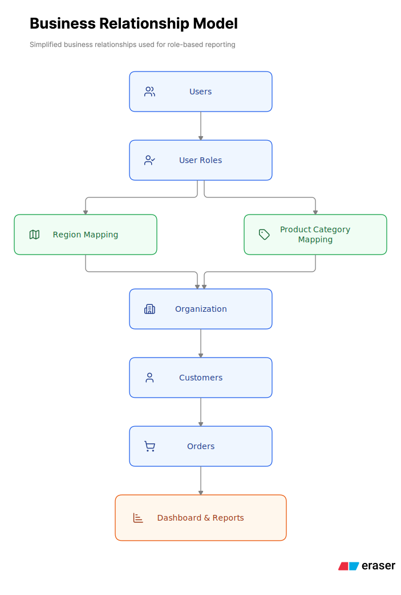

# Why Do Entity Framework Queries Become Slow in Complex Reporting Systems?

**Estimated Reading Time:** 10 Minutes

## Skills Demonstrated

- Entity Framework Core
- Performance Optimization
- SQL Query Analysis
- Database Design
- Software Architecture
- Enterprise Reporting
- System Design

---

## Overview

Entity Framework Core works exceptionally well for most business CRUD applications.

However, as applications evolve, reporting modules often become far more complex than transactional workflows.

This article presents a real-world reporting challenge where query performance degraded as business rules, role-based filtering, and multiple mapping tables were introduced over time.

All business entities, table names, and implementation details have been generalized to preserve confidentiality while keeping the engineering concepts accurate.

---

## Business Scenario

Consider an enterprise application used by multiple business roles.

Each user sees different dashboard statistics and reports depending on:

- User Role
- Assigned Region
- Assigned Product Categories
- Business Unit
- Customer Mapping

Unlike transactional screens, reporting must combine data from several loosely related entities before applying business rules.

As reporting requirements expanded and business rules became more sophisticated, query execution time increased noticeably.

---

## Simplified Data Model

The following simplified diagram illustrates the business relationships involved in generating role-based reports.

> Business entities, relationships, and terminology have been generalized to preserve confidentiality while demonstrating the underlying architectural concepts.

The reporting module relies on the following simplified entities:

- Orders
- Customers
- Products
- Partners
- Users
- Roles
- Regions
- Region Mapping
- Product Categories
- Business Units

Some entities have direct relationships, while many business rules depend on mapping tables instead of simple foreign key relationships.

These mapping tables make report generation flexible but significantly increase query complexity.

---

## The Challenge

Each dashboard serves a different business role and requires a different view of the same data.

### Administrator

Can access all data.

### Regional Manager

Can access customers within assigned regions.

### Sales Representative

Can access customers mapped to assigned regions and only specific product categories.

### Business Manager

Can access data belonging to assigned business units.

As a result, the WHERE clause and JOIN conditions change dynamically based on the logged-in user's permissions.

A single reporting query may involve multiple joins, mapping tables, and conditional filters before returning the final result.

---

## Why Performance Started Degrading

Several factors combined to slow down the reporting queries.

### Multiple Mapping Tables

Reports had to traverse multiple mapping tables to enforce business rules and access control instead of joining core tables directly.

### Dynamic Filters

Different users generated different SQL because each role required different filtering logic.

### Large Datasets

Reporting queries processed significantly more records than transactional screens.

### Complex LINQ Expressions

As business requirements evolved, LINQ expressions became increasingly complex and difficult to optimize.

### Generated SQL

Even when the LINQ query appeared simple, Entity Framework generated large SQL statements containing multiple joins, subqueries, and conditional predicates.

---

## Investigation

Instead of assuming Entity Framework was the problem, the first step was understanding the SQL being generated.

The investigation focused on:

- Reviewing generated SQL
- Analyzing execution plans
- Identifying expensive joins
- Checking missing or ineffective indexes
- Measuring execution time
- Comparing generated SQL with equivalent hand-written SQL

This helped distinguish ORM overhead from actual database bottlenecks.

Only after identifying the real bottlenecks did we begin implementing targeted optimizations.

---

## Engineering Decisions

Several approaches were evaluated before selecting the final solution.

### Option 1 – Keep One Large LINQ Query

A single LINQ query was maintained to handle all reporting scenarios.

**Decision:** Rejected

**Reason:** The query became difficult to understand, maintain, and optimize as business rules continued to grow.

---

### Option 2 – Move Everything to Stored Procedures

Complex reporting logic was moved entirely into database stored procedures.

**Decision:** Rejected

**Reason:** While performance improved, business logic became tightly coupled to the database, reducing maintainability and increasing deployment complexity.

---

### Option 3 – Hybrid Approach

Entity Framework was used for standard data access, while carefully written SQL was used only for highly complex reporting queries.

**Decision:** Selected

**Reason:** This provided better performance without sacrificing maintainability or overall application architecture.

---

## Solution Approach

No single optimization solved the problem.

Instead, performance improvements came from several targeted changes applied across the data access layer, database design, and reporting architecture.

### Simplified Query Logic

Large LINQ expressions were divided into smaller, more focused queries where appropriate.

This improved readability and made performance bottlenecks easier to identify.

---

### Projection Instead of Loading Entire Entities

Reports selected only the required columns instead of loading complete entity graphs.

This reduced memory usage, network traffic, and SQL complexity.

---

### Optimized Database Indexes

Indexes were reviewed and added on frequently filtered and joined columns, especially mapping tables.

This significantly reduced table scans.

---

### Reduced Unnecessary Navigation Loading

Only relationships required for each report were loaded.

Unused `Include()` statements were removed or replaced with more efficient projections.

---

### Used Raw SQL for Complex Reports

Reports involving many joins and dynamic filters were implemented using optimized SQL.

Entity Framework continued to handle parameter binding and result mapping, preserving consistency across the application.

---

### Cached Lookup Data

Reference data that changed infrequently was cached to reduce repeated database access.

This improved dashboard responsiveness while reducing database load.

---

### Modular Query Building

Instead of maintaining one large query, filtering logic was separated into reusable query components.

This improved readability, maintainability, and testing.

---

## Lessons Learned

Entity Framework itself was not the primary performance bottleneck.

The real challenge was the increasing complexity of business rules and access control requirements.

> **Query design became an architectural concern rather than simply an ORM configuration issue.**

Performance improvements came from simplifying query design, improving database structure, and choosing the right tool for each scenario.

---

## Best Practices

- Review generated SQL regularly.
- Analyze execution plans before optimizing.
- Keep LINQ queries readable and modular.
- Select only required columns.
- Create appropriate indexes.
- Cache stable reference data where appropriate.
- Measure performance before and after every optimization.
- Use raw SQL only when it provides a clear benefit.

---

## Common Mistakes

- Assuming Entity Framework is always the performance bottleneck.
- Loading complete entity graphs for reporting.
- Ignoring execution plans.
- Building one extremely large LINQ query.
- Optimizing before measuring.

---

## Key Takeaways

- Reporting queries behave differently from transactional queries.
- Business rules often contribute more to complexity than Entity Framework itself.
- Small improvements across query design, indexing, caching, and projections can produce significant performance gains.
- Raw SQL is an excellent option for specific reporting scenarios but should complement Entity Framework rather than replace it.
- **Always optimize based on measurement, not assumptions.**

---

## Related Topics

- Redis Distributed Cache
- SQL Server Performance
- PostgreSQL Query Optimization
- API Performance
- Software Architecture

---

Thank you for reading.

I hope this engineering case study provided practical insights into designing and optimizing complex reporting systems.

Feel free to explore the other Engineering Journal articles in this repository.

---

**Article Version:** 1.0

**First Published:** July 2026

**Last Reviewed:** July 2026